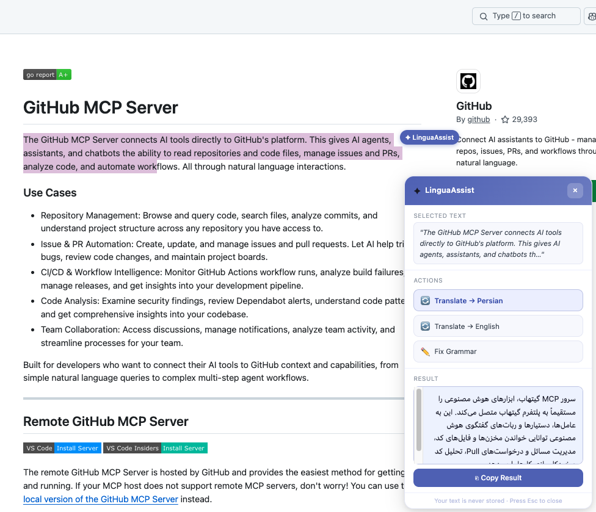
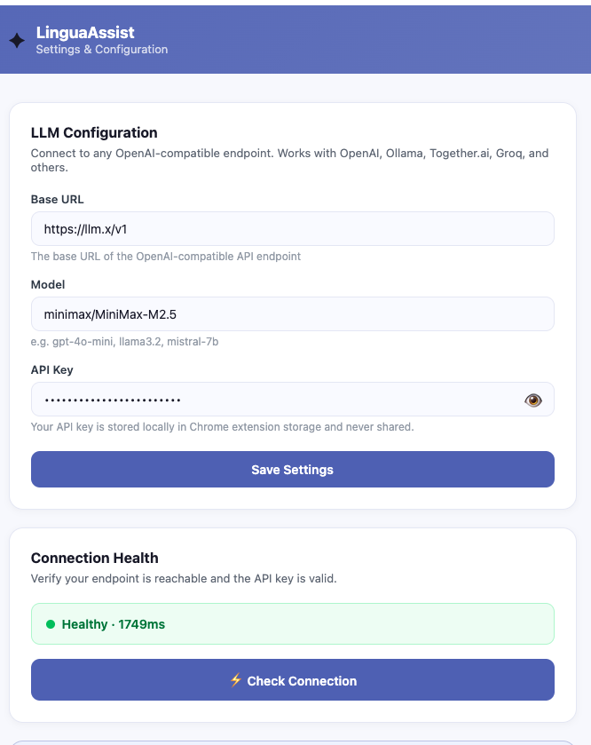

# LinguaAssist

> A bilingual Persian/English Chrome extension that translates text and fixes grammar using your own LLM — fully private, no data leaves your browser.





---

## Table of Contents

- [Features](#features)
- [How It Works](#how-it-works)
- [Prerequisites](#prerequisites)
- [Getting Started (Development)](#getting-started-development)
- [Building for Production](#building-for-production)
- [Loading the Extension in Chrome](#loading-the-extension-in-chrome)
- [Configuring Your LLM](#configuring-your-llm)
- [Using the Extension](#using-the-extension)
- [Project Structure](#project-structure)
- [Privacy](#privacy)

---

## Features

- 🔄 **Translate → Persian** — Translate any selected text to Persian (Farsi)
- 🔄 **Translate → English** — Translate any selected text to English
- ✏️ **Fix Grammar** — Fix grammar, spelling, punctuation, and clarity
- ⚡ Works with any **OpenAI-compatible** API endpoint (OpenAI, Ollama, Together.ai, Groq, and more)
- 🔒 **Private by design** — text is never stored; your API key lives only in Chrome's local extension storage

---

## How It Works

1. You select text on any webpage.
2. A floating **✦ LinguaAssist** panel appears near your selection.
3. Pick an action (translate to Persian, translate to English, or fix grammar).
4. The extension sends the text to your configured LLM endpoint and shows the result.
5. Copy the result with one click.

---

## Prerequisites

| Tool | Minimum Version |
|------|----------------|
| [Node.js](https://nodejs.org/) | 18+ |
| [npm](https://www.npmjs.com/) | 9+ |
| Google Chrome | 114+ (Manifest V3 support) |

An OpenAI-compatible LLM endpoint is also required (see [Configuring Your LLM](#configuring-your-llm)).

---

## Getting Started (Development)

```bash
# 1. Clone the repository
git clone https://github.com/rezacloner1372/LinguaAssist.git
cd LinguaAssist

# 2. Install dependencies
npm install

# 3. Start the development build (watch mode — rebuilds on every file save)
npm run dev
```

The compiled extension is written to the **`dist/`** folder.  
Leave the `npm run dev` terminal running while you develop — any saved change will automatically trigger a rebuild.

> **TypeScript type checking** (without emitting files):
> ```bash
> npm run type-check
> ```

---

## Building for Production

```bash
npm run build
```

This runs Webpack in production mode (minified output) and writes the final extension to **`dist/`**.

---

## Loading the Extension in Chrome

After building (`npm run dev` or `npm run build`), load the extension as an unpacked extension:

1. Open Chrome and navigate to **`chrome://extensions`**.
2. Enable **Developer mode** (toggle in the top-right corner).
3. Click **"Load unpacked"**.
4. Select the **`dist/`** folder inside this repository.
5. The **✦ LinguaAssist** icon will appear in your Chrome toolbar.

> **After every rebuild in development**, click the 🔄 refresh icon on the extension card in `chrome://extensions` to pick up the latest changes. Content scripts on already-open tabs also need a page refresh.

---

## Configuring Your LLM

Before using the extension you must point it at an LLM endpoint:

1. Click the **✦ LinguaAssist** toolbar icon.
2. Click **"⚙ Configure Settings"** (or right-click the icon → *Options*).
3. Fill in the three fields:

   | Field | Example |
   |-------|---------|
   | **Base URL** | `https://api.openai.com/v1` |
   | **Model** | `gpt-4o-mini` |
   | **API Key** | `sk-...` |

4. Click **"Save Settings"**.
5. Click **"⚡ Check Connection"** to verify the endpoint is reachable.

### Local LLM with Ollama

```
Base URL : http://localhost:11434/v1
Model    : llama3.2        (or any model you have pulled)
API Key  : ollama          (any non-empty string)
```

Start Ollama before using the extension:
```bash
ollama serve
```

### OpenAI

```
Base URL : https://api.openai.com/v1
Model    : gpt-4o-mini
API Key  : <your OpenAI API key>
```

---

## Using the Extension

1. Navigate to any webpage.
2. **Select** a piece of text with your mouse.
3. A floating **✦ LinguaAssist** panel appears automatically.
4. Click one of the three action buttons:
   - **Translate → Persian**
   - **Translate → English**
   - **Fix Grammar**
5. Wait for the result to appear in the panel.
6. Click **"⎘ Copy Result"** to copy it to your clipboard.
7. Press **Esc** or click **×** to dismiss the panel.

---

## Project Structure

```
LinguaAssist/
├── public/
│   └── icons/              # SVG icons (16, 32, 48, 128 px)
├── src/
│   ├── background/
│   │   └── service-worker.ts   # Background service worker — calls the LLM API
│   ├── content/
│   │   ├── content.tsx          # Content script — detects text selection
│   │   └── FloatingPanel.tsx    # Floating action panel injected into pages
│   ├── popup/
│   │   ├── index.tsx            # Popup entry point
│   │   ├── index.html
│   │   └── Popup.tsx            # Toolbar popup UI
│   ├── settings/
│   │   ├── index.tsx            # Settings page entry point
│   │   ├── index.html
│   │   └── Settings.tsx         # LLM configuration UI
│   └── shared/
│       ├── messages.ts          # Chrome runtime message helpers
│       ├── storage.ts           # chrome.storage.sync helpers
│       ├── theme.ts             # Shared theme tokens
│       └── types.ts             # Shared TypeScript types
├── manifest.json            # Chrome Extension Manifest V3
├── webpack.config.js        # Webpack build configuration
├── tsconfig.json            # TypeScript configuration
└── package.json
```

---

## Privacy

- Text is sent to your LLM **only** when you explicitly trigger an action.
- No text is stored by the extension after the response is received.
- Your API key is stored in **Chrome's local extension storage** only — it never leaves your device.
- No data is collected or transmitted to LinguaAssist servers.
- All requests go **directly** from your browser to your configured LLM endpoint.
