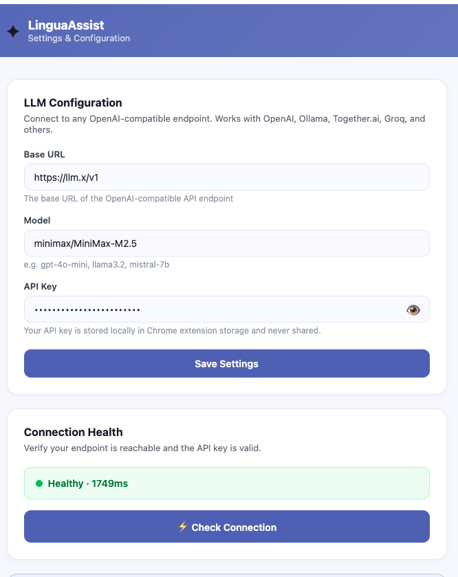
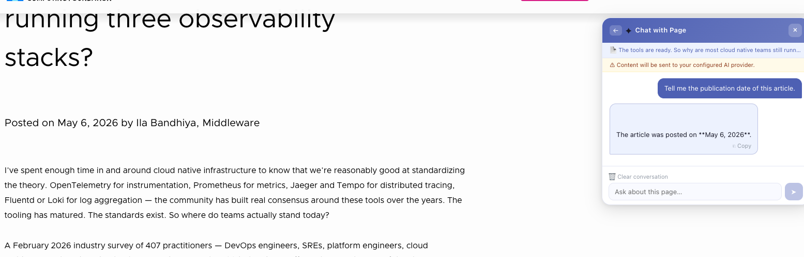
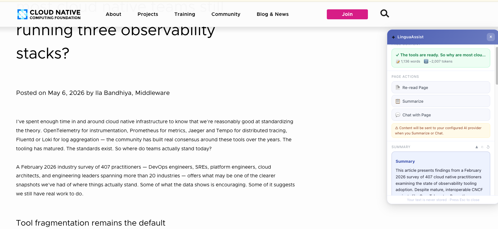
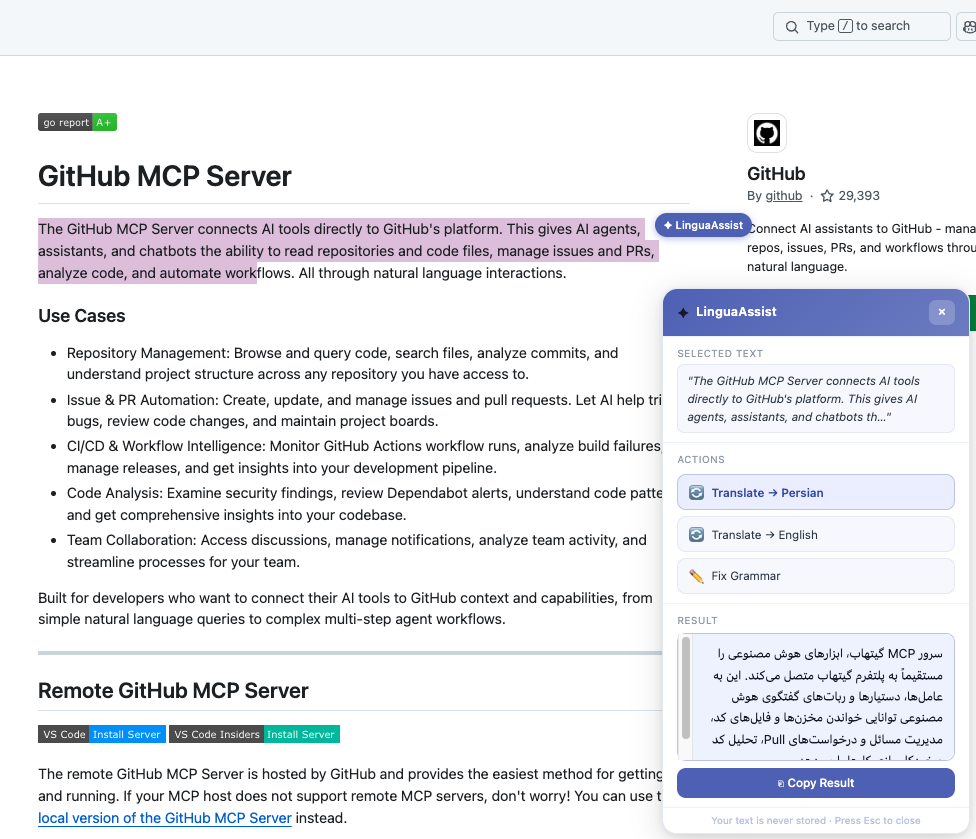

<div align="center">

# ✦ LinguaAssist

**A bilingual Persian ⇄ English AI companion for the browser.**

Translate, explain, and rewrite selected text; summarize and chat with entire pages —
powered by your own OpenAI-compatible LLM endpoint.

[](https://github.com/rezacloner1372/LinguaAssist)
[](https://developer.chrome.com/docs/extensions/develop)
[](LICENSE)
[](CONTRIBUTING.md)

</div>

---

## Screenshots

| | |
|:---:|:---:|
|  |  |
| **Floating panel & text actions** | **Chat with Page** |
|  |  |
| **Structured page summary** | **Demo** |

---

## Features

### Text tools (on any selection)

- 🔄 **Translate ⇄** — auto-detects direction between Persian and English, tuned for natural, native-quality output
- 💡 **Explain** — concise explanations with key-term glosses
- 📋 **Summarize** — condenses the selection into 2–4 bullet points
- ✏️ **Fix Grammar / Formal / Casual / Draft Reply** — editing and tone tools that keep the original language

### Manual translate

- ⌨️ Type or paste any word, sentence, or paragraph in the **Translate** tab — no selection needed — with automatic RTL/LTR detection and ⌘/Ctrl+Enter to submit

### Page intelligence

- 📄 **Read Page** — extracts the main readable content, skipping navbars, sidebars, footers, ads, and popups
- 🧾 **Summarize Page** — structured markdown summary with key points and action items
- 💬 **Chat with Page** — streaming Q&A grounded in the extracted content, with automatic non-streaming fallback

### Everywhere

- 🖐 **Draggable panel** — grab the header and move it anywhere; it stays put until closed
- 🔊 **Listen (TTS)** — results read aloud with automatic Persian/English voice selection
- 📚 **Vocabulary** — save translations; review, search, and export as CSV from Settings
- ↕️ **RTL-aware rendering** — Persian text displays correctly throughout
- 🧠 **Context-aware** — token estimation, chunking, and truncation respect your model's context window
- ⚡ **Provider-agnostic** — works with any OpenAI-compatible endpoint: OpenAI, Ollama, Together.ai, Groq, and more
- 🔒 **Private by design** — content leaves your browser only when you trigger an action, always going directly to your endpoint

---

## Installation

### From source (development)

**Prerequisites:** Node.js 18+, npm 9+, Google Chrome 114+.

```bash
git clone https://github.com/rezacloner1372/LinguaAssist.git
cd LinguaAssist
npm install
npm run build          # or: npm run dev  (watch mode)
```

Then load it in Chrome:

1. Open `chrome://extensions`.
2. Enable **Developer mode** (top-right toggle).
3. Click **Load unpacked** and select the `dist/` folder.

> After each rebuild during development, click the 🔄 refresh icon on the extension card, and reload any open tabs so content scripts update.

---

## Configuration

Click the **✦ LinguaAssist** toolbar icon → **⚙ Configure Settings** (or right-click → *Options*).

| Field | Example | Notes |
|-------|---------|-------|
| **Base URL** | `https://api.openai.com/v1` | Must be the OpenAI-compatible root, including `/v1` |
| **Model** | `gpt-4o-mini` | Any model your endpoint serves |
| **API Key** | `sk-...` | Stored only in `chrome.storage.local` |

Click **⚡ Check Connection** to verify the endpoint before use.

### Optional settings

| Setting | Default | Purpose |
|---------|---------|---------|
| `maxContextTokens` | 8000 | Caps page content sent in summarize/chat requests |
| `temperature` | 0.1 (text) / 0.3 (chat) | Generation randomness |
| Language A / B | `fa` / `en` | Translation pair; direction auto-detected |
| TTS toggle | on | Show/hide 🔊 Listen buttons |

### Provider examples

**OpenAI**

```text
Base URL : https://api.openai.com/v1
Model    : gpt-4o-mini
API Key  : <your OpenAI API key>
```

**Ollama (local)**

```text
Base URL : http://localhost:11434/v1
Model    : llama3.2        (or any pulled model)
API Key  : ollama          (any non-empty string)
```

Start Ollama first: `ollama serve`

---

## Usage

### Text actions

1. Select text on any webpage — the floating panel appears near your selection.
2. Pick an action: **Translate ⇄**, **Explain**, **Summarize**, **Fix Grammar**, **Formal**, **Casual**, or **Draft Reply**.
3. The result streams in progressively. Copy it with **⎘ Copy Result**, listen with 🔊, or save translations with **📚 Save**.
4. Close with **Esc** or **×**.

### Manual translate

1. Open the panel (text selection or the persistent **✦ Page** button) and switch to the **⌨️ Translate** tab.
2. Type or paste text, then click **🔄 Translate ⇄** or press **⌘/Ctrl + Enter**.

### Page intelligence

1. Click the **✦ Page** button (bottom-right) or switch to the **Page Intel** tab.
2. Click **Read Page** to extract content.
3. **Summarize** for a structured summary, or **Chat with Page** to ask questions ("What are the key takeaways?", "Summarize section 2.").

### Moving the panel

Drag the panel header to reposition it anywhere on screen. It stays where you drop it until closed; the next open anchors near your selection again.

---

## Project Structure

```text
LinguaAssist/
├── public/
│   └── icons/                   # Icons and demo assets
├── src/
│   ├── background/
│   │   └── service-worker.ts    # LLM requests, streaming, SSE parsing, TTS chunking
│   ├── content/
│   │   ├── content.tsx          # Content script: selection trigger, page FAB, caching
│   │   ├── FloatingPanel.tsx    # Panel UI: tabs, drag handling, streaming results
│   │   ├── ChatView.tsx         # Chat bubble component (TTS support)
│   │   ├── ListenButton.tsx     # 🔊 TTS listen button
│   │   ├── markdown.tsx         # Lightweight markdown renderer
│   │   ├── pageExtractor.ts     # Main-content extraction
│   │   └── tokenUtils.ts        # Token estimation, chunking, truncation
│   ├── popup/                   # Toolbar popup
│   ├── settings/                # Options page (LLM config, vocabulary manager)
│   └── shared/
│       ├── messages.ts          # Runtime message + streaming port helpers
│       ├── storage.ts           # chrome.storage.local (settings, vocabulary)
│       ├── textDirection.ts     # RTL detection, language-pair labels
│       ├── theme.ts             # Shared theme tokens
│       └── types.ts             # Shared TypeScript types
├── manifest.json                # Chrome Extension Manifest V3
└── webpack.config.js            # Build configuration
```

## Architecture

LinguaAssist follows the standard Manifest V3 layout:

- **Content script** (`src/content/`) — selection detection, floating panel UI (React inside a shadow DOM root), page extraction.
- **Service worker** (`src/background/`) — all LLM traffic. Builds system prompts per action, calls `{baseUrl}/chat/completions`, parses SSE streams, posts `CHUNK`/`DONE`/`ERROR` back over a long-lived port (`lingua-stream`), and falls back to non-streaming on failure.
- **Shared** (`src/shared/`) — typed message contracts, storage helpers, RTL utilities.

Streaming flows: `FloatingPanel` → `streamLLMRequest` (port) → service worker → provider; results render with a typewriter effect, and markdown is only applied to the final text.

---

## Development

```bash
npm run dev          # Webpack watch mode → dist/
npm run build        # Production build (minified)
npm run type-check   # TypeScript, no emit
```

See [CONTRIBUTING.md](CONTRIBUTING.md) for the workflow, conventions, and PR process. Changes are tracked in [CHANGELOG.md](CHANGELOG.md).

---

## Troubleshooting

| Symptom | Cause & Fix |
|---------|-------------|
| `404 Not Found` on requests | Base URL is wrong. It must be the OpenAI-compatible root **including `/v1`** — e.g. `https://api.example.com/v1`, not `https://api.example.com` or a `/anthropic` path (that's a different API). Compare with a working `curl` to `{baseUrl}/chat/completions`. |
| Buttons do nothing after code changes | Stale build — rerun `npm run build`, refresh the extension in `chrome://extensions`, and reload the tab. |
| Streaming errors mid-response | The service worker automatically retries once without streaming; if that fails, the error shows in the panel. Check the worker console (extension card → *service worker* link). |
| Gateway rejects health check | Some gateways reject extra params — the health check already sends a minimal body; verify your key and model name. |
| Persian text renders left-aligned | This is handled automatically via RTL detection; if you see it wrong, report an issue with the page and text. |

---

## Privacy

- Text, manual input, and page content are sent to your LLM **only** when you explicitly trigger an action — always directly from your browser to your endpoint.
- Nothing is stored after a response, except vocabulary entries you save explicitly (local storage only).
- Your API key stays in `chrome.storage.local`; no data ever reaches LinguaAssist servers.
- Review your provider's privacy policy for how they handle processed content.

---

## License

Released under the [MIT License](LICENSE).
